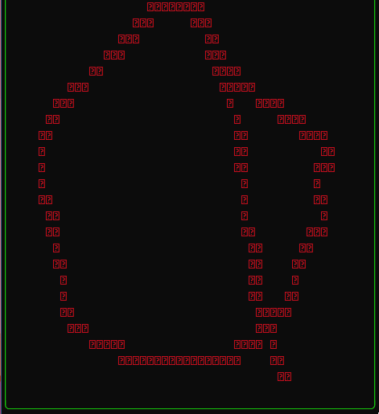

# what is this
a small drawing app for dualpanto (https://hpi.de/baudisch/projects/dualpanto.html)

used for the Building Interactive Systems Bachelors Class at HPI

# where to put it

put it NEXT to [dualpantoframework](https://github.com/HassoPlattnerInstituteHCI/dualpantoframework) and check out branch [BIS-com-assignment](https://github.com/HassoPlattnerInstituteHCI/dualpantoframework/tree/BIS-com-assignment)

the resulting structure should look like this:
```
.
├── dualdraw
│   ├── CMakeLists.txt
│   ├── build
│   ├── cmake-build-debug
│   ├── main.cpp
│   └── readme.md
└── dualpantoframework
   ├── documentation
   ├── firmware
   ├── hardware
   ├── package.json
   ├── readme.md
   └── utils
```


# how to compile

## windows:

use clion and the bundled Cmake + MingW

This project will most likely NOT compile on the VisualStudio Toolchain (illeagal conversion from string to char* in the protocal) or out of the box MingW (missing thread pool implementation needed for the UI component)

## macOS:

cmake + gcc

# how to run

Select dualDraw as your CMAKE target, build it and execute it. Don't forget to change your port in your main.cpp


# how does it look when it's working



# known issues

application crashes from time to time due to asynchronous access on the event queue.

FIX: For the time being, just restart and try again
